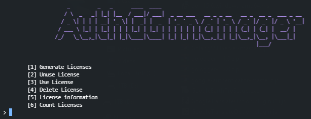

# AuthGG-Manager
Python Auth.GG Manager for managing users, licenses and HWIDs

```yaml
Python Version Used: Python 3.8.9
  
  Requirements:
    pip install requests
  
  How to run:
    python main.py
```

# Main Screen


# Users Screen


# License Screen

